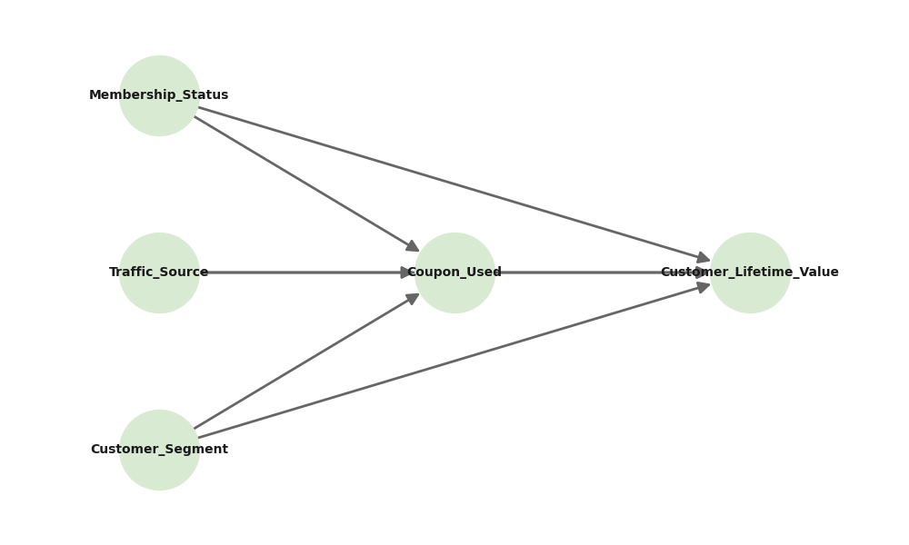

# 🚀 E-Commerce ROI Optimization via Causal Inference (Double ML)

## 📌 概要 (Overview)
本プロジェクトは、Eコマースにおける「クーポンのバラマキによる利益率（マージン）の毀損」というビジネス課題に対し、**因果推論（Causal Inference）**および**Double Machine Learning (DML)**を用いてアプローチした分析リポジトリです。

単純な相関分析の罠（交絡バイアス）を排除し、マーケティング予算のROIを最大化するための「真のLTVリフト効果」を算出。経営やマーケティングの意思決定に直結する、個別化された介入戦略を提案します。

---

## 📊 1. データセットと変数の特徴
Kaggleの「E-commerce Orders Dataset 2026」を使用しています。トランザクション、顧客属性、マーケティングチャネルなどを網羅したデータセットです。

本分析では、因果推論のフレームワークに合わせて以下の変数を定義しました。
- **目的変数 (Outcome, Y)**: `Customer_Lifetime_Value` (顧客生涯価値/LTV)
- **処置変数 (Treatment, T)**: `Coupon_Used` (クーポンの利用有無)
- **交絡因子 (Confounders, W)**: `Membership_Status`, `Traffic_Source`, `Customer_Segment`
  - ※処置と結果の両方に影響を与え、見せかけの相関を生む変数
- **異質性特徴量 (Heterogeneity Features, X)**: `Customer_Age`, `Discount_Percent`
  - ※クーポンの効果が「人によってどう違うか」を測るための変数

---

## 🎯 2. 分析の軌跡と意思決定プロセス (The Analytical Journey)

本分析は、単なる機械学習モデルの構築ではなく、ビジネス構造の理解とバイアスの排除を主眼に置いています。以下に、各ステップでの可視化結果と、それに基づく分析判断のプロセスを記録します。

### Step 1: 構造的因果モデル（SCM）の定義と課題設定
モデリングの前に、まずはビジネスドメインの知識に基づき、変数の依存関係をDAG（有向非巡回グラフ）として定義しました。

**【分析判断とインサイト】**
データを単純集計すると「クーポンを利用した顧客の方がLTVが高い」という結果が出ますが、このDAGが示す通り、それは致命的な罠です。
ロイヤリティの高い顧客（`Membership_Status`等）は、元々購買意欲が高く、かつクーポンを見つけて使う能力にも長けています。つまり、「クーポンがLTVを上げた」のではなく、**「放っておいても定価で買う優良顧客が、単にクーポンを独占して利益を削っているだけ」**の可能性（交絡バイアス）をここで提起しました。この仮説を検証することが、本プロジェクトの第一目標となります。

### Step 2: 傾向スコアによるバイアスの証明（相関 != 因果）
Step 1の仮説（交絡の存在）を視覚的に証明するため、ロジスティック回帰を用いて各顧客の「クーポン利用確率（傾向スコア）」を算出し、実際の利用有無で分布を比較しました。

**【分析判断とインサイト】**
クーポン利用群（青）と未利用群（赤）の分布が、明確に乖離していることが確認できました。これは、**クーポンが全顧客にランダムに利用されているわけではなく、特定の属性（高ロイヤリティ層など）に極端に偏って利用されている**という強力な証拠です。
この結果を受け、集団の平均値を単純比較する従来のアプローチ（ナイーブなA/Bテスト等の集計）は無意味であり、直ちに棄却すべきと判断。交絡因子の影響を機械学習で直交化（除去）する「Double Machine Learning (DML)」の導入を決定しました。

### Step 3: CATEの算出と予算最適化戦略の策定
DML（EconML + LightGBM）を適用し、バイアスを排除した「クーポンの真のLTVリフト効果（CATE）」を顧客の年齢やセグメントごとに算出・可視化しました。

**【分析判断とインサイト】**
クーポンの効果には強烈な異質性（ばらつき）があることが判明しました。この散布図が、今後の経営戦略を決定づける最終的なアウトプットとなります。赤の破線（Lift = 0）を基準に、以下のアクションプランを策定しました。

- **The Targets (真のターゲット / CATE > 0)**:
  - 赤線より上の層。クーポンを受け取ることで真に購買意欲が喚起され、LTVが純増する。
  - 👉 **【意思決定】** マーケティング予算をこの層に100%集中投下し、LTVを最大化する。
- **The Margin Destroyers (利益の破壊者 / CATE < 0)**:
  - 赤線より下の層。クーポンがなくても商品を購入する層であり、割引は純粋な利益（マージン）の毀損を生んでいる。
  - 👉 **【意思決定】** 全員一律のマスマーケティングを即座に停止。この層へのクーポン配布を止め、代わりに新商品告知などの「非金銭的エンゲージメント」へ切り替えることで営業利益率を改善する。

---

## 🧠 3. 今回の学び (Key Learnings)

### ① `EconML` と `DoWhy` の特徴と今後の活用法
今回初めて因果推論のモダンライブラリを使用し、それぞれの強力な役割分担を学びました。
- **DoWhy**: 「因果関係の仮説を立てる（DAGの定義）」と「識別（どの変数を統制すべきかの数学的証明）」に特化している。ドメイン知識をコードに落とし込む設計図として非常に優秀。
- **EconML**: 識別されたモデルに対し、最新の機械学習アルゴリズム（今回はDML）を適用して「効果を推定する」エンジンとして機能する。
- **今後の活用**: この2つは対立するものではなく、**「DoWhyで論理を組み、EconMLで推論する」**というパイプラインが実務における因果推論のゴールデンスタンダードになると実感しました。

### ② データ分析における「予測精度」と「意思決定」の違い
Kaggleなどのコンペでは「LTVをどれだけ正確に予測するか（Yの予測）」が重視されますが、ビジネスの実務で本当に求められているのは**「こちらのアクション（T）によって、結果（Y）がどれだけ変化するか（リフト効果）」**を正しく測ることだと学びました。予測モデルだけでは「誰に施策を打つべきか」という意思決定は最適化できないという視点を得たのは大きな収穫です。

### ③ 「バイアスの可視化」の強力さ
傾向スコアの分布図を描画し、「Treated（青）」と「Control（赤）」の山が完全にズレているのを見た瞬間、ステークホルダーに対して「現状の評価がいかに危険か」を説明する最強の武器になると感じました。高度な数式よりも、まずはEDA段階でのバイアスの可視化が重要です。

---

## 📚 【Appendix】活用した因果推論手法の詳細解説

本分析で用いた因果推論のコア概念について、備忘録として詳細をまとめます。

### 1. 処置変数 (T: Treatment) と 結果変数 (Y: Outcome)
- **処置変数 (T)**: 企業側がコントロールできる「介入」のこと。今回は「クーポンの配布/利用（0 or 1）」。
- **結果変数 (Y)**: その介入によって動かしたいビジネスKPI。今回は「顧客生涯価値 (LTV)」。
データ分析の目的は、Tを変化させた時にYがどう変化するか（因果効果）を測ることです。

### 2. 交絡因子 (W: Confounder)
T（クーポン利用）とY（LTV）の**両方に影響を与えてしまう第3の変数**のことです。
例えば「優良会員であるか（Membership_Status）」。優良会員は「クーポンにも気づきやすい(T=1)」し、「元々たくさん買い物をする(Yが高い)」。
この交絡因子が存在すると、クーポン自体の効果なのか、優良会員だからLTVが高いのかが区別できなくなり、**見せかけの相関（Spurious Correlation）**が生まれます。これを統制（条件付け）することが因果推論の第一歩です。

### 3. 傾向スコア (Propensity Score)
交絡因子の多次元データ（年齢、性別、会員ランクなど）を、「**その人が処置（クーポン）を受ける確率（0〜1）**」という1次元のスコアに圧縮したものです。
ロジスティック回帰などで算出されます。傾向スコアが同じ人同士を比べれば、「クーポンをもらった/もらわなかった」という条件がランダム（RCT: ランダム化比較試験に近い状態）になり、公平な比較が可能になります。

### 4. Double Machine Learning (DML)
複雑な交絡が存在するデータから、真の因果効果を抜き出すための強力な機械学習手法です。以下の3ステップで直交化（Orthogonalization）を行います。
1. **Yの予測**: 交絡因子 W と特徴量 X から、結果 Y を機械学習（LightGBM等）で予測し、実際の Y との**誤差（残差）**を求める。（＝クーポン以外の要因で決まるLTVを引いておく）
2. **Tの予測**: 同様に W と X から、処置 T を予測し、実際の T との**誤差（残差）**を求める。（＝予測できない「たまたまクーポンを使った」要素だけを抽出する）
3. **残差同士の回帰**: 上記1と2で得られた「ノイズを取り除いた純粋な T の変動」が、「純粋な Y の変動」にどう影響しているかを回帰分析する。
これにより、交絡因子の影響を排除したクリーンな因果関係を導き出します。

### 5. CATE (Conditional Average Treatment Effect: 条件付き平均処置効果)
集団全体の平均的な効果（ATE）ではなく、**「特定の条件 X（例：年齢が30代、割引率が10%）を満たすグループにおいて、処置 T がどれだけ結果 Y を押し上げるか」**という個別の効果を指します。
CATEを算出することで、「Aさんにはクーポンが効くが、Bさんには逆効果」といった**パーソナライゼーション（個別最適化）**が可能になり、ROIの最大化に直結します。